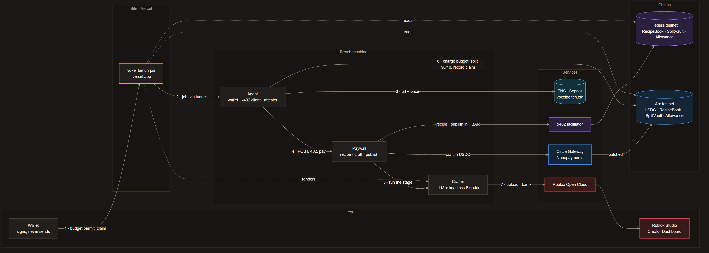
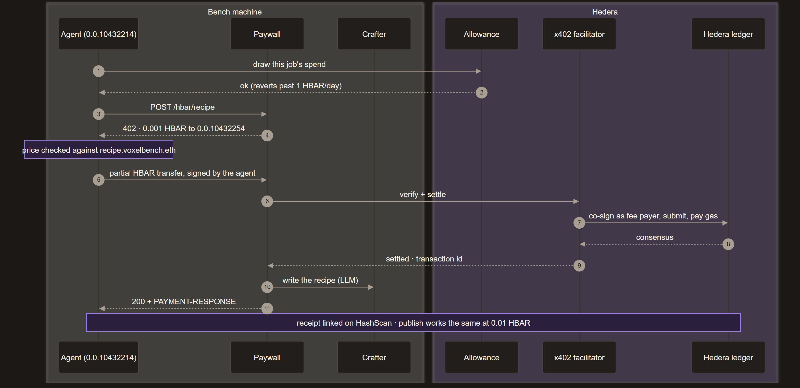
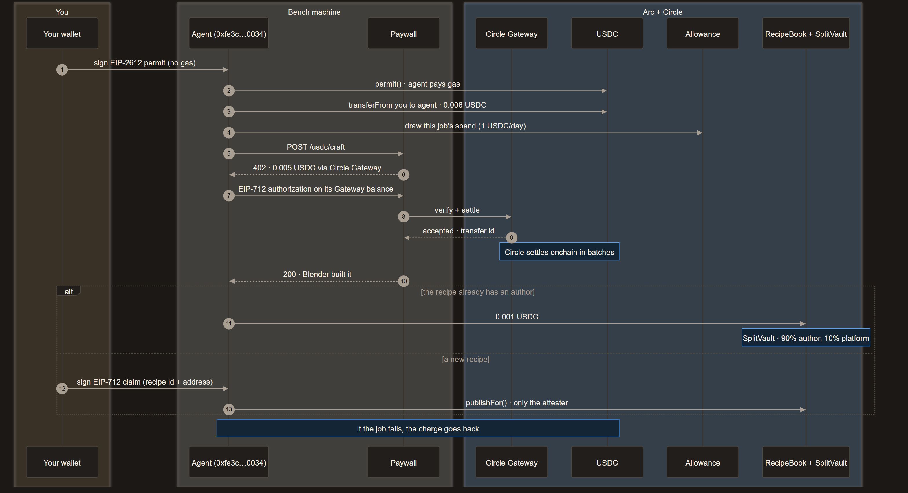
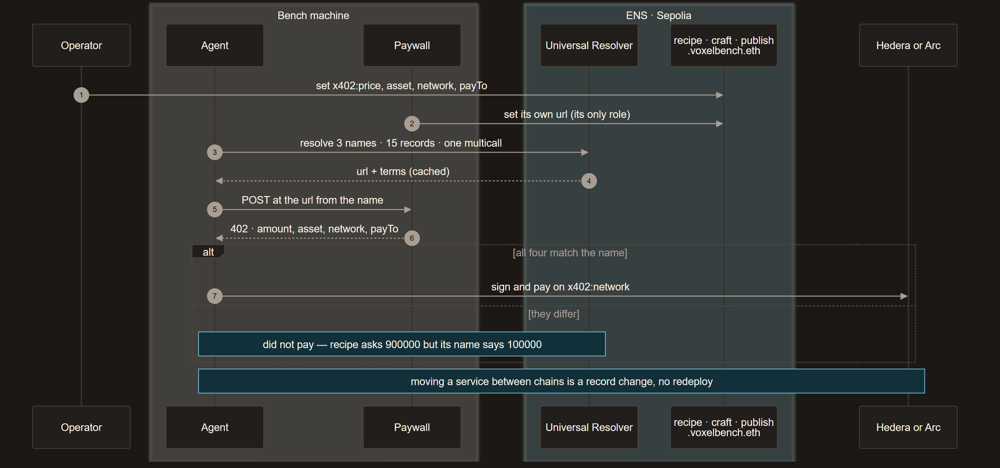

# Voxel Bench

**Craft your Roblox game, one object at a time.**

Type a sentence. An agent builds the 3D model, pays every service it uses from
a budget you set, and uploads the result to your own Roblox account. Every
object comes from a reusable **recipe**, and whoever wrote the recipe earns 90%
of every craft, split onchain where they can check it.

**Live: https://voxel-bench-psi.vercel.app**

Built from scratch for **ETHOnline 2026** — Hedera, ENS and Circle/Arc tracks.

---

## Sixty seconds

1. **Give your agent a budget.** Sign in with an email, Google, X or a wallet,
   and sign a USDC limit on Arc. No gas, no transaction — a permit. The token
   refuses the agent anything past it.
2. **Describe it.** One sentence becomes a recipe: ingredients with sizes in
   studs, Roblox's own unit. Headless Blender builds it and renders a preview
   in about seven seconds.
3. **Watch the agent pay.** Each stage is a separate paid service. The agent
   resolves `recipe.voxelbench.eth`, `craft.voxelbench.eth` and
   `publish.voxelbench.eth`, reads the price from the name, and pays over x402
   — HBAR on Hedera for the recipe, USDC through Circle Nanopayments on Arc for
   the craft. The browser shows every step, with the transaction.
4. **Claim it.** Sign a message, free, and the recipe is yours on `RecipeBook`.
   From then on anyone crafting with it pays you 90%.
5. **It lands in your Roblox account.** Publish, and it uploads through Open
   Cloud into your own account with its render as the icon: it is in your
   Creator Dashboard, under Creations. Or pick pieces from your backpack and the
   marketplace, and the agent lays them out as an obby you play in Studio:
   spawn, hazards that kill, platforms that move, a timed finish.

Nothing to install to craft. Studio is where you play what you built.

## What is live

| | |
|---|---|
| A sentence → a recipe → a crafted object | ~7 s in Blender, 3–48 s for the model |
| Native Roblox parts | `.rbxmx` in exact studs and colours; moderation approves in ~3 s |
| Per-person budgets | an EIP-2612 permit on Arc USDC, enforced by the token, not by us |
| Three paid stages over x402 | prices read from ENS, refused when a 402 disagrees with the name |
| Circle Nanopayments | the craft stage settled through Circle Gateway, batched, sub-cent |
| `RecipeBook` · `SplitVault` · `Allowance` | live on Hedera and Arc testnets, 64 tests, verified against the chain |
| Marketplace and backpack | read from the chain; getting a recipe pays its author |
| Playable obbies | 2 to 12 recipes become a course, every piece's author paid once |
| Publishing to Roblox | into your own account, with the render as the icon |
| An audit, and its finding closed | SR-01: authorship of a seen id could be taken; now recorded only through the agent that crafted it |

## Why it is paid onchain

**Two cents in, ninety out.** A craft should cost cents, and a card cannot
process two cents for less than two cents. The harder half is the other way:
paying forty authors ninety cents each, in twenty countries, costs more in fees
and onboarding than it moves.

**Authors get paid without trusting us.** The split is a contract and the
ledger is public. An author does not audit our bookkeeping; they read
`RecipeBook`.

**The agent's limits are not a prompt.** Your budget is a signed permit the
token enforces. The platform's own cap is a contract, `Allowance`, drawn from
before every craft. Neither is a setting a model could be talked past — a
prepaid card, not your credit card.

## The tracks

**Hedera.** The recipe and publish stages are paid in HBAR over x402 through
the public facilitator. `RecipeBook`, `SplitVault` and `Allowance` are deployed
on Hedera testnet and each craft settles against them. What cost us time is in
[FEEDBACK.md](FEEDBACK.md), with evidence — `msg.value` arrives in tinybars,
which the docs do not say.

**ENS.** Every service is a name on ENSv2, and the name carries the price, the
asset, the chain and who is paid. The agent will not sign a 402 that disagrees
with the name. A service may edit its own `url` record and not its price, so the
two numbers are not both written by the party being paid. Moving a service from
Hedera to Arc is a record change; the agent follows it without a redeploy.

**Circle / Arc.** People give their agent a budget in USDC on Arc by signing a
permit, and each job is taken from it before any work is paid for. The craft
stage settles through Circle Gateway's Nanopayments: the agent keeps a USDC
balance in Gateway, signs each 0.005 USDC payment against it, and Circle settles
in batches. Our own facilitator stays as the fallback for the Arc side.

Every use of the chain, and the non-blockchain alternative we rejected for
each, is in [docs/ONCHAIN.md](docs/ONCHAIN.md).

## The audit

The contracts were audited by a second pair of eyes, with fuzzing and stateful
invariants, and the audit found something real. A recipe's id is the hash of
its content, and whoever had seen an unclaimed id could claim it — a signature
proves a wallet, not the work. It is closed on both sides of the chain:
`RecipeBook` records an author only from its attester, the agent that crafts,
and the agent relays a claim only for the person it crafted for. The discovery
test that showed the capture working now shows it failing. The write-up is in
[docs/CONTRACT_AUDIT.md](docs/CONTRACT_AUDIT.md) and `contracts/audit/`.

## On scope

> You can build a playable Roblox game from this platform, within the genres we
> support, and refine it in Studio.

Not "any game" — anyone who knows Roblox would spot that. Objects and obbies
work today; objects that carry their own scripts are next.

Roblox prohibits blockchain integrations and off-platform monetisation, so no
Roblox in-game revenue is ever touched — what your game earns is yours, in
full. The onchain economy is entirely our own: crafting fees, publishing fees
and recipe royalties. Roblox is an export target, not the platform, and the
pipeline also emits GLB for any other engine.

---

## How it is built

```
prompt -> recipe (JSON) -> headless Blender -> GLB + preview render
                        -> native parts     -> .rbxmx -> Roblox
```

The model writes the recipe and never touches Blender. Same recipe, same
object, every time — and when something looks wrong the recipe is a small
readable file you fix by hand rather than a dice roll you re-roll.

Roblox gets native parts rather than a mesh. FBX arrives exactly 100× too
large (it stores centimetres) and grey (Roblox imports textures, not material
colours); parts are written in studs and carry their own colour, so neither
problem exists.



1. **You sign, never send.** Your wallet signs the budget permit and, later,
   the claim. Both reach the agent through the site.
2. **The site hands the job to the agent** on the bench machine. For the demo
   that is a tunnel; on mainnet, a dedicated server ([docs/DEMO.md](docs/DEMO.md)).
3. **The agent asks ENS** where each service is and what it costs.
4. **The agent calls the paywall and pays each 402.** The recipe and publish
   stages are paid in HBAR through the x402 facilitator on Hedera. The craft
   stage is paid in USDC through Circle Gateway, which settles on Arc in
   batches.
5. **The paywall runs the stage it was paid for** on the crafter: the LLM writes
   the recipe, and headless Blender builds and renders it.
6. **On Arc, the agent charges your budget**, pays the author's 90% through
   `RecipeBook` and `SplitVault`, and records your claim.
7. **The crafter uploads the `.rbxmx`** through Roblox Open Cloud into your
   account. It appears in your Creator Dashboard and plays in Studio.

The dashed lines only read. The site reads Hedera and Arc directly for the
marketplace, the backpack and the caps, and fetches renders from the crafter.

The site asks the agent, not the crafter. The visitor signs once, to give their
agent a budget; after that the browser watches the agent spend it, stage by
stage, and never holds a key. Each stage is a separate x402-gated service: no
key is shared with any of them, and no stage can do another's job. Who pays
what, on which chain, is in [docs/PAYMENT_FLOW.md](docs/PAYMENT_FLOW.md).

Blender cannot run on Vercel, so the site and the crafter live apart: the site
on Vercel, the crafter on a real machine behind a tunnel. That is the same
split x402 asks for anyway — the crafter is a service that charges per call.
When the crafter's machine is asleep the site says so and shows the checked-in
sample rather than a broken page.

## Architecture by sponsor

What each sponsor does in one craft. The step numbers match the numbers in
each diagram. The diagrams' sources are the `.mmd` files beside them in
[docs/architecture/](docs/architecture/).

### Hedera: the recipe and publish stages, paid in HBAR over x402



1. **The agent draws the job's spend from `Allowance`.**
2. **`Allowance` answers.** Past 1 HBAR a day it reverts, and the job does not
   happen. The brake is the chain, not a check the agent could skip.
3. **The agent calls `POST /hbar/recipe`.**
4. **The paywall answers 402**, asking 0.001 HBAR to `0.0.10432254`. The agent
   checks that price against `recipe.voxelbench.eth` before anything else.
5. **The agent signs a partial HBAR transfer** from its own account,
   `0.0.10432214`.
6. **The paywall hands it to the x402 facilitator** to verify and settle.
7. **The facilitator co-signs as fee payer and submits it**, paying the gas.
   So the agent needs an account, never gas.
8. **Hedera reaches consensus.**
9. **The facilitator reports it settled**, with the transaction id.
10. **The paid stage runs**: the crafter's LLM writes the recipe.
11. **The agent gets the result**, with the receipt in the `PAYMENT-RESPONSE`
    header. The site links it on HashScan.

Publishing works the same way at 0.01 HBAR.

| Hedera testnet | |
|---|---|
| `RecipeBook` | `0x36C6C3e991B8673c44B7216f1b0499eA19f8Df41` |
| `SplitVault` | `0xBaE7C31f9080733DB1Cd18Ed99b5d70fF65406DE` |
| `Allowance` | `0xB95A8CDa8AF890039a6455C1066C686E3Af7aB1C` |

### Arc and Circle: your budget, the craft stage and the author's share, in USDC



1. **You sign an EIP-2612 permit** on Arc's USDC, naming the agent as spender.
   It is a signature, not a transaction.
2. **The agent submits `permit()`** and pays the gas.
3. **Each job is charged once**, with `transferFrom` from you to the agent:
   0.006 USDC for a craft, 0.01 for a publish. USDC itself refuses anything
   past your budget.
4. **The agent draws the job's spend from `Allowance` on Arc**, capped at
   1 USDC a day.
5. **The agent calls `POST /usdc/craft`.**
6. **The paywall answers 402**, asking 0.005 USDC through Circle Gateway.
7. **The agent signs an EIP-712 authorization** against the USDC balance it
   keeps in Gateway. No onchain transaction per payment.
8. **The paywall has Circle Gateway verify and settle it.**
9. **Gateway accepts it** and returns a transfer id. Circle settles these
   payments onchain in batches, which is what makes a half-cent payment
   worth making.
10. **The paid stage runs**: headless Blender builds the object.

Then one of two things happens:

- **The recipe already has an author.** (11) The agent pays `RecipeBook`
  0.001 USDC, and `SplitVault` credits 90% to the author and 10% to the
  platform. The author withdraws when they like.
- **The recipe is new.** (12) You sign an EIP-712 claim naming the recipe's id
  and your address. (13) The agent relays it as `publishFor()`. `RecipeBook`
  accepts it only from its attester, the agent, and the agent relays it only
  for the person it crafted for. That is the audit's SR-01, closed.

If a job fails, the charge goes back to you. Circle Gateway is the main path;
our own facilitator settles a plain EIP-3009 transfer as the fallback
(`VOXEL_ARC_SETTLEMENT=own`).

| Arc testnet | |
|---|---|
| USDC | `0x3600000000000000000000000000000000000000` |
| `RecipeBook` | `0xC456D809Fb6B71a1901c4E5957c0F70b034783BA` |
| `SplitVault` | `0x870771ecaaf8c059354145B7A0cC5D4Da2A4b721` |
| `Allowance` | `0xcc8936bC21B8a521314740B21F300cdF7c0Ca627` |

### ENS: where each service is, and what it may charge



1. **The operator sets each name's terms**: `x402:price`, `x402:asset`,
   `x402:network` and `x402:payTo`.
2. **Each service can set only its own `url`.** It can move hosts, but it
   cannot change its price.
3. **The agent resolves the three names** through the Universal Resolver: 15
   records in one multicall, about a second.
4. **It keeps the url and the terms**, cached for every craft after that.
5. **The agent calls the service at the url from its name.**
6. **The service answers 402 with its own terms**: amount, asset, network and
   payee.
7. **The agent compares all four with the name.** If they match, it signs and
   pays on the chain in `x402:network`. If any differs, it stops with the
   reason, for example: `did not pay — recipe asks 900000 but its name says 100000`.

Moving a service between chains is a record change, not a redeploy. That is
how `craft` moved to Arc while `recipe` and `publish` stayed on Hedera.
`Allowance` stops the agent overspending; ENS stops a service overcharging.

| ENS on Sepolia (ENSv2) | |
|---|---|
| names | `recipe.voxelbench.eth` · `craft.voxelbench.eth` · `publish.voxelbench.eth` |
| our registry | `0x49d8963F8098840b0457aFedDe23bD68AEC46EB0` |
| our resolver | `0x6A64e52852906E9a2452c8eD4ac2cb5d11F47DA3` |

## Run it

```bash
python services/crafter.py             # the work,     :8000
node services/paywall/server.mjs       # the prices,   :4402
node services/agent/server.mjs         # the wallet,   :4403
node services/facilitator/server.mjs   # the gas,      :4404
cd web && npm install && npm run dev   # the site
```

Or from a terminal, without the site:

```bash
node services/agent/orchestrate.mjs "an oil drum"
python bench/make.py "a stone well with a bucket"   # the crafter alone
```

Copy `.env.example` to `.env` and `web/.env.example` to `web/.env.local`; each
says what every variable is for. The short version:

- The agent needs `HEDERA_AGENT_ACCOUNT_ID` and `HEDERA_AGENT_PRIVATE_KEY`.
  Without them, point `web/.env.local` at `CRAFTER_URL` alone and the site
  crafts directly for nothing — running the bench should not require a funded
  wallet.
- `VOXEL_ENS_PARENT` turns on name resolution. Without it the agent uses
  `PAYWALL_URL` and takes each price from the 402 that states it.
- `NEXT_PUBLIC_PRIVY_APP_ID` gives email and Google sign-in; without it the page
  offers whatever wallet extensions the browser has.
- The catalog of names and previews is Supabase: the site reads it with the
  publishable key, the agent writes it with the service key. The schema is
  `supabase/migrations/0001_recipes.sql`; the platform's own recipes are
  published with `node services/agent/publish-stock.mjs --publish`.
- Every job is charged to the signed-in visitor's budget. `VOXEL_USER_PAYS=off`
  brings back the agent paying for everything. On testnet a new account is sent
  0.10 USDC once (`VOXEL_TEST_CREDIT`); on mainnet people bring their own.
- On Arc the craft stage settles through Circle Gateway; `VOXEL_ARC_SETTLEMENT=own`
  switches it to our facilitator.

Running this for real is a separate question, answered in
[docs/MAINNET.md](docs/MAINNET.md).

## Layout

```
bench/       the crafter: headless Blender, the recipe library, the obby runtime
services/    the crafter, the paywall, the paying agent, the Arc facilitator, the Roblox publisher
contracts/   RecipeBook, SplitVault and Allowance; tests, audit package, deploy and migration scripts
web/         the site: Next.js 16, TypeScript, Tailwind 4, GSAP
docs/        design, payment flow, audit, build log
out/         crafter output, gitignored
```

## Vocabulary

One word per concept, in the contract, the API and the UI alike.

| Word | Means |
|---|---|
| recipe | the reusable JSON description of an object |
| ingredients | the primitives a recipe is composed of |
| craft | the verb: run a recipe, pay, get an asset |
| crafter | someone who crafts with a recipe |
| author | whoever wrote the recipe, and earns from it |
| RecipeBook | the contract holding recipes, authors and splits |
| attester | the agent, the only address that can record an author |

## Building an obby

On the bench, **Build an obby** lists the pieces you own, the ones you
collected and the obby set on the marketplace. Pick them in the order a player
runs them and drag to reorder. The agent (`services/agent/obby.mjs`) lays them
out as a course that floats, climbs and drops between jumps a character can
make, with hazards below the jumps, and crafts it as one recipe. Pieces you do
not have are got along the way, and each author is paid once.

What a piece does comes from its name — start, platform, checkpoint, hazard,
moving platform, finish, or scenery for anything else; `docs/RECIPE_LIBRARY.md`
lists the words. The Roblox writer makes each piece a model named for its role
and adds one script, `bench/obby_runtime.lua`, that gives the roles their
behaviour. Drag the `.rbxmx` into Studio and press Play.

## Deploying

The site deploys from `web/`, not the repo root. `web/vercel.json` declares the
framework explicitly: a project created without a detected framework serves
`public/` as a static site and never builds Next.

```bash
cd web && npx vercel deploy --prod
```

Set `CRAFTER_URL` and `AGENT_URL` in the Vercel project once a bench is
reachable, `NEXT_PUBLIC_PRIVY_APP_ID` for sign-in, and the two Supabase
variables for the catalog. `NEXT_PUBLIC_*` is read at build time, so it takes
effect on the next deployment. How the bench is reached for the demo, through
two tunnels, is in [docs/DEMO.md](docs/DEMO.md).

## Publishing to Roblox

Needs an API key from create.roblox.com/dashboard/credentials with the `assets`
scope (read and write), and the creator id. The site asks each person for
their own and never stores it.

Publishing ends in your Creator Dashboard
(create.roblox.com/dashboard/creations), which the page links to. From there the
model is yours like anything else in your account: putting it on the Creator
Store, giving it a Try in Roblox experience, or pricing it are settings of your
Roblox account.

The key carries an IP allowlist. Leave it empty and every request returns 403
with a message that never mentions the IP — the single most common way to lose
an hour here.

```bash
export ROBLOX_API_KEY=...  ROBLOX_USER_ID=...
python services/roblox_upload.py out/market_stall.fbx "Market Stall"
```

## Documents

| | |
|---|---|
| [docs/STATUS.md](docs/STATUS.md) | **what works today, with addresses and measurements** |
| [docs/PAYMENT_FLOW.md](docs/PAYMENT_FLOW.md) | **who pays what, and on which chain — the happy path in plain words** |
| [docs/ONCHAIN.md](docs/ONCHAIN.md) | every use of the chain, the non-blockchain alternative we rejected, and the sponsor tracks |
| [docs/CONTRACT_AUDIT.md](docs/CONTRACT_AUDIT.md) | the contracts, the audit, and SR-01 from finding to fix |
| [docs/PITCH.md](docs/PITCH.md) | the pitch, and what the demo shows |
| [docs/DEMO.md](docs/DEMO.md) | how the bench runs for the demo, and the final QA on the deployed site |
| [docs/MAINNET.md](docs/MAINNET.md) | what it takes to run this for real |
| [docs/RECIPE_LIBRARY.md](docs/RECIPE_LIBRARY.md) | building the recipe library: the loop, the format, the themed kits |
| [docs/LOG.md](docs/LOG.md) | what has actually been built and measured, and what has not |
| [FEEDBACK.md](FEEDBACK.md) | what cost us time in each sponsor's technology, with evidence |
| [CONTRIBUTING.md](CONTRIBUTING.md) | branches, PRs, commits, secrets |
| [AI_USAGE.md](AI_USAGE.md) | the AI disclosure required by the rules |
