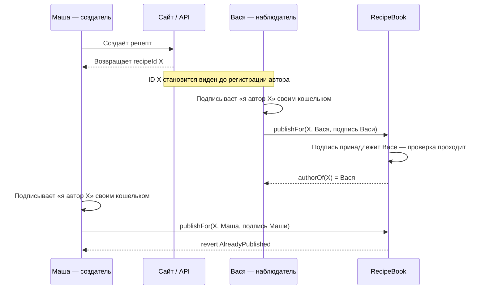
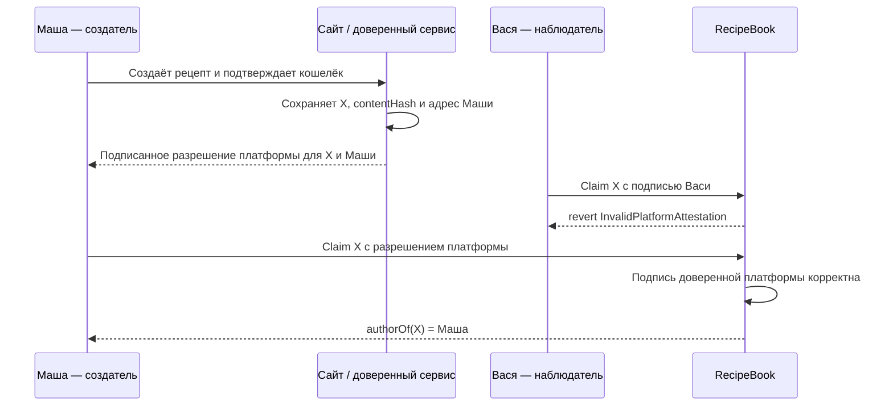

# SR-01: trace захвата авторства

**Идентификатор:** SR-01 — first-claim authorship capture
**Затронутая логика:** `RecipeBook.publishFor`
**Условие риска:** `recipeId` становится виден до того, как настоящему автору выдано доверенное подтверждение происхождения.

## До полного исправления

### Что происходит в контракте

1. Маша создаёт содержимое рецепта. Сайт вычисляет или получает его уникальный `recipeId` — назовём его `X`.
2. До регистрации авторства `X` становится доступен другому пользователю: например, в данных сайта, API или ожидающей транзакции.
3. Вася не подделывает подпись Маши. Он подписывает заявление об авторстве `X` **своим** кошельком.
4. Вася вызывает `publishFor(X, адрес_Васи, подпись_Васи)`.
5. Текущая проверка подписи отвечает только на вопрос «действительно ли Вася подписал это заявление?». Ответ — да.
6. Контракт сохраняет Васю как автора. Последующее требование Маши отклоняется, потому что ID уже занят.

Если затем кто-то крафтит этот рецепт с оплатой 1 ETH при 10% комиссии платформы, 0.9 ETH кредитуется Васе, хотя рецепт сделала Маша.

## После полного исправления: подтверждение платформы

Полный фикс меняет проверку: контракт принимает claim только с подписью доверенного адреса платформы, привязанной к `recipeId`, хэшу содержимого и адресу автора. Вася может увидеть ID, но не может выпустить подпись платформы для себя.

## Как воспроизводится в тестах

| Файл | Роль |
|---|---|
| [`../test/FrontRunPublishFor.t.sol`](../test/FrontRunPublishFor.t.sol) | Воспроизводит уязвимый порядок: сначала валидный claim Васи, затем отклонённый claim Маши. Этот тест должен проходить, поскольку он демонстрирует текущий риск. |
| [`../test/SR01RecipeAuthorshipRegression.t.sol`](../test/SR01RecipeAuthorshipRegression.t.sol) | Проверяет частичное исправление: старый прямой `publish` отключён, а подпись Маши нельзя привязать к адресу Васи. |

Этот trace отражает логику функции, а не скорость сети: результат зависит только от того, чей claim обработан первым.
