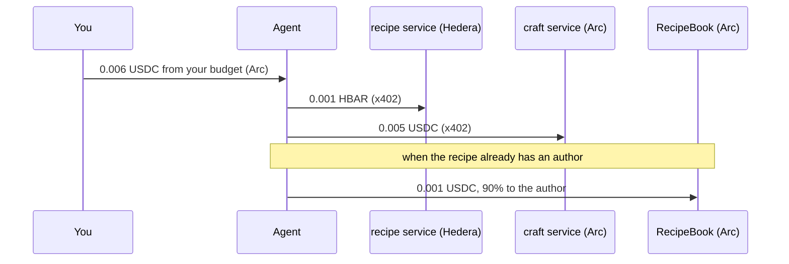

# Who pays what, and on which chain

The short version: **you only ever touch Arc, in USDC. Hedera is where the
agent pays two of its suppliers, in HBAR.** The platform pays the gas, always.

---

## The happy path

1. **Sign in** — with an email, Google, X or a wallet. You pay nothing. On
   testnet the platform sends a new account **0.10 USDC on Arc**, once, so there
   is something to try it with. On mainnet you would bring your own.

2. **Set your agent's budget** — say 0.05 USDC. You sign a message: no gas, no
   transaction from you. The agent records it on **Arc** and pays the gas. From
   then on the agent can take up to that much of your USDC, and not a cent more.

3. **Describe something and press Craft** — "a stone well with a bucket".
   - You pay the agent **0.006 USDC on Arc**, from your budget.
   - The agent pays the service that writes the recipe **0.001 HBAR on Hedera**.
   - The agent pays the service that builds it in Blender **0.005 USDC on Arc**.
   - The recipe is new, so it has no author to pay yet.

4. **Claim it** — you sign a message, free. The agent records you as its author
   on **Arc** and pays the gas.

5. **Someone else gets your recipe from the marketplace.**
   - They pay the agent **0.006 USDC on Arc**.
   - The agent pays the craft service **0.005 USDC on Arc**, and pays
     `RecipeBook` **0.001 USDC on Arc**, which splits it: **0.0009 to you**, the
     author, and 0.0001 to the platform.

6. **Publish to Roblox.**
   - You pay the agent **0.01 USDC on Arc**.
   - The agent pays the service that uploads it **0.01 HBAR on Hedera**.
   - The render goes up with it, as the model's icon.

An obby works like step 5 for each piece in it you do not already have: 0.005
USDC for the craft, plus 0.001 USDC for each piece bought, and every one of
those authors is paid.

---

## In one table

| | Arc (USDC) | Hedera (HBAR) |
|---|---|---|
| **You** | everything you pay, and everything you earn as an author | nothing |
| **The agent** | the craft service, and the authors | the recipe service and the publish service |
| **Gas** | paid by the platform | paid by the platform |

---

## Two brakes

- **Yours.** The budget you sign for is a USDC allowance. The USDC contract
  itself refuses the agent anything past it, whoever asks. Lowering it is
  signing again.
- **The platform's.** Before every job the agent draws what it is about to
  spend from an `Allowance` contract, one per chain: 1 HBAR a day on Hedera,
  1 USDC a day on Arc. Past that the contract refuses and the job does not
  happen, whoever's budget it was spending.

## When something fails

The agent takes your payment first, in one transfer. If the job fails before the
object is crafted, it sends that payment back. You see both transfers.

## Who pays the gas

The platform, everywhere:

- the x402 payments to the services are signed by the agent and submitted by a
  facilitator, which pays the gas;
- your budget, your claim and the transfers from your budget are sent by the
  agent, which pays the gas.

You sign messages; you never send a transaction.

## One honest caveat

When you pay 0.006 USDC for a new recipe, 0.005 goes to the craft service on
Arc. The 0.001 HBAR the recipe service costs comes out of the platform's HBAR
reserve — your USDC does not travel to Hedera. It is a contractor charging you
in dollars and paying each supplier in its own currency. On mainnet the agent
would convert and top that reserve up; see [MAINNET.md](MAINNET.md).

## Why your budget is in USDC on Arc

USDC can be approved with a signature (EIP-2612 `permit`), so giving your agent a
budget costs you no gas and needs no funded account. HBAR is Hedera's native
token and has no equivalent: a budget in HBAR would mean sending a transaction,
and paying its gas, to deposit it somewhere first.

## Where it lives

| | |
|---|---|
| your budget: what to sign, the permit relayed, the charge, the refund | `services/agent/budget.mjs` |
| the bill for each job, and every step logged | `services/agent/server.mjs` |
| the agent paying the services over x402 | `services/agent/pay.mjs` |
| the platform's cap | `contracts/src/Allowance.sol`, `services/agent/allowance.mjs` |
| the authors' share | `contracts/src/RecipeBook.sol`, `SplitVault.sol` |
| prices, and which chain each service settles on | the ENS names `recipe`, `craft` and `publish.voxelbench.eth` |
